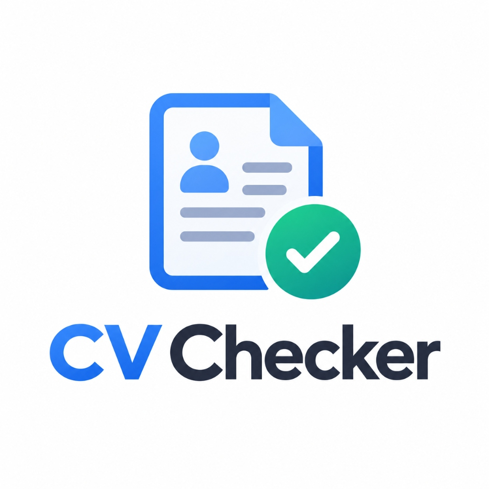
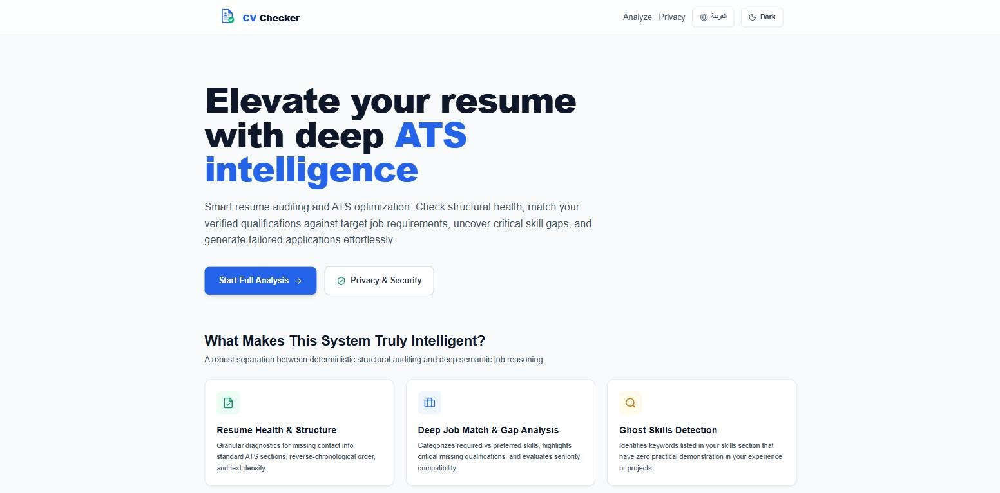
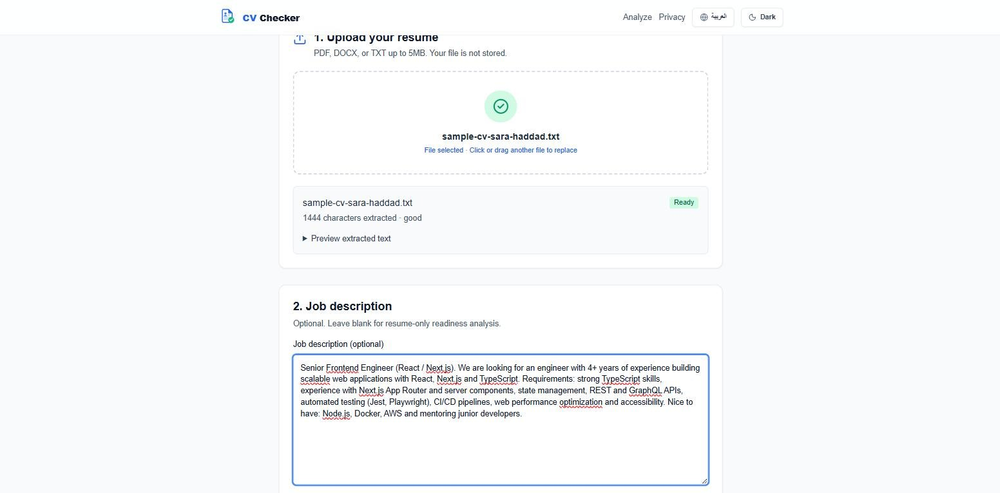
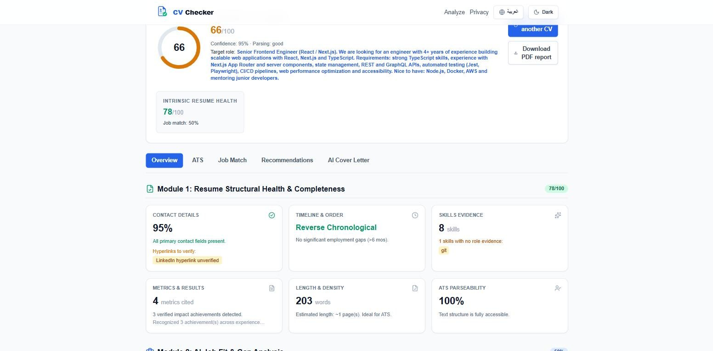
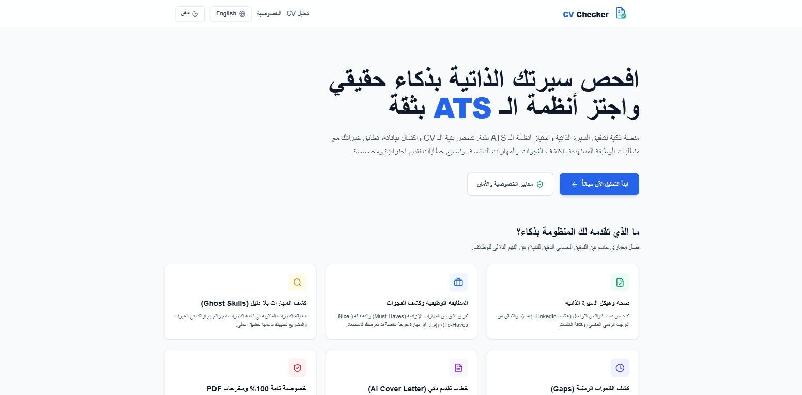

<div align="center">



# CV Checker

### AI-Powered ATS Resume Checker & Career Assistant — English / العربية

A privacy-first web app that audits your resume, scores it with a **transparent, deterministic ATS engine**, matches it against a job description, uncovers skill gaps and generates **evidence-grounded cover letters** — without inventing facts about the candidate.

[](LICENSE)


**Engineered by Anas Aldahamsheh — تطوير: أنس الدحامشة**



</div>

---

## 📖 Overview

CV Checker helps job seekers understand how their resume performs against Applicant Tracking Systems (ATS) and a specific job posting.

- The **ATS score is calculated by deterministic TypeScript rules** — the AI never decides the score — so every point is explainable.
- **Google Gemini** (optional) is used only for structured extraction, evidence matching and writing, and every AI output is validated with **Zod schemas and grounding checks** that reject anything not supported by the resume.
- Resumes and job descriptions are **processed per request and never stored** — no database, no accounts, no logs of CV text.

> The ATS Compatibility Score is an explainable estimate based on this application's documented rules. It does not reproduce any proprietary ATS vendor algorithm.

---

## ✨ Features

### 📄 Resume Upload & Parsing
- Upload **PDF, DOCX or TXT** (up to 5 MB) with drag & drop
- Files validated by extension, MIME type and file signature
- Preview of the extracted text; scanned / textless documents are detected and flagged

### 🩺 Resume Health & Structure (resume-only mode)
- Contact details completeness and hyperlink checks
- Timeline order (reverse-chronological) and **employment gap detection**
- **Ghost skills detection** — skills listed without any evidence in your experience
- Metrics & measurable results, length & density, ATS parseability

### 🎯 Job Match & Gap Analysis (with a job description)
- **ATS Compatibility Score** with a weighted, deterministic score breakdown
- Required vs. preferred requirements, each mapped to **evidence from your resume** with an evidence-strength rating
- Missing skills, seniority fit and prioritized **recommendations**

### ✍️ Grounded AI Writing
- **AI cover letter generator** — job-tailored or general — built only from verified resume evidence
- Edit, copy or download the cover letter as **PDF**
- APIs for grounded application answers and resume bullet tailoring

### 🌍 Experience
- Full **Arabic / English** support with proper **RTL** layout (`/ar` and `/en`)
- **Dark mode**, responsive design and accessibility checks (axe)
- One-click **PDF report** of the full analysis

### 🔒 Privacy & Security
- Request-scoped processing — nothing is written to a database, filesystem, browser storage or logs
- `Cache-Control: no-store`, input size limits and per-route rate limiting on every API
- Strict security headers (CSP, `X-Frame-Options`, `Referrer-Policy`, `Permissions-Policy`)
- Secrets stay server-side

---

## 📸 Screenshots

| Upload & job description | Analysis results |
|:---:|:---:|
|  |  |
| **Arabic interface (RTL)** | **Home** |
|  |  |

---

## 🧰 Tech Stack

| Layer | Technology |
|---|---|
| Framework | [Next.js 16](https://nextjs.org/) (App Router, Route Handlers) |
| UI | [React 19](https://react.dev/) + TypeScript |
| Styling | [Tailwind CSS 3](https://tailwindcss.com/) |
| Forms & validation | React Hook Form + [Zod](https://zod.dev/) |
| Document parsing | [pdf.js](https://mozilla.github.io/pdf.js/) (PDF), [Mammoth](https://github.com/mwilliamson/mammoth.js) (DOCX) |
| AI | [Google Gemini API](https://ai.google.dev/) with structured JSON output |
| PDF export | [Playwright](https://playwright.dev/) (headless Chromium) |
| Testing | [Vitest](https://vitest.dev/), Testing Library, Playwright + axe-core |
| Deployment | [Netlify](https://www.netlify.com/) (`netlify.toml` included) |

---

## 🚀 Getting Started

### Prerequisites

- **Node.js 20.9+** (Node 22 LTS recommended — see [`.nvmrc`](.nvmrc))
- **npm**

### Installation

```bash
# 1. Clone the repository
git clone https://github.com/anas-aldahamsheh/CV-Checker.git
cd CV-Checker

# 2. Install dependencies
npm install

# 3. (Optional) Install Chromium — needed for the "Download PDF" features
npx playwright install chromium

# 4. Create your environment file
cp .env.example .env.local      # on Windows (PowerShell): copy .env.example .env.local

# 5. Start the development server
npm run dev
```

Open **[http://localhost:3000/en](http://localhost:3000/en)** (English) or **[http://localhost:3000/ar](http://localhost:3000/ar)** (Arabic).

### Environment Variables

All variables are documented in [`.env.example`](.env.example).

| Variable | Required | Default | Description |
|---|---|---|---|
| `GEMINI_API_KEY` | No* | — | Google Gemini API key — get one at [Google AI Studio](https://aistudio.google.com/apikey) |
| `GEMINI_MODEL` | No* | — | Gemini model name to use |
| `APP_URL` | No | `http://localhost:3000` | Public base URL |
| `AI_TIMEOUT_MS` | No | `20000` | AI request timeout (ms) |
| `AI_MAX_OUTPUT_TOKENS` | No | `1200` | Max tokens per AI response |
| `MAX_UPLOAD_BYTES` | No | `5242880` | Max upload size (5 MB) |

\* `GEMINI_API_KEY` and `GEMINI_MODEL` must be set **together**. Without them, the app uses a conservative deterministic extraction fallback — ATS scoring is deterministic in both modes.

> ⚠️ Never commit your real `.env.local` file. It is already excluded by `.gitignore`.

---

## 📜 Available Scripts

| Command | Description |
|---|---|
| `npm run dev` | Start the development server |
| `npm run build` | Create a production build |
| `npm run start` | Run the production build |
| `npm run lint` | Lint with ESLint |
| `npm test` | Run unit tests (Vitest) |
| `npm run test:watch` | Run unit tests in watch mode |
| `npm run test:e2e` | Run end-to-end tests (Playwright) |

---

## 🔌 API

All endpoints accept only `POST`, validate input on the server, return `Cache-Control: no-store` and apply per-route rate limits. Raw CV and job description text is never logged.

| Endpoint | Input | Output |
|---|---|---|
| `/api/parse-resume` | multipart `file` (PDF, DOCX or TXT, max 5 MB) | Extracted text + parse report |
| `/api/analyze` | Resume text, optional job description, locale | Deterministic analysis result |
| `/api/cover-letter` | Validated resume evidence, job description, tone, locale | Evidence-grounded cover letter |
| `/api/application-answer` | Resume evidence, optional job description, question, locale | Evidence-grounded answer |
| `/api/tailor` | Resume evidence, optional job description, selected bullet, locale | Tailored summary or grounded rewrite |
| `/api/export-pdf` | Report HTML, file name | PDF file |

Errors: `400` malformed input · `413` too large · `422` unreadable upload · `429` rate limited.

---

## 🏗️ Architecture

A privacy-first **modular monolith** — no database, accounts, object storage or background workers.

```txt
.
├── app/                      # Next.js App Router
│   ├── [locale]/             #   Localized pages (en / ar): home, analyze, results, privacy
│   └── api/                  #   Route handlers (parse, analyze, generate, export)
├── src/
│   ├── ats/                  # Pure deterministic ATS engine: checks, normalization, scoring
│   ├── ai/                   # Gemini adapter, prompts, Zod contracts, grounding validation
│   ├── features/             # UI flows: resume upload, results dashboard, generators
│   ├── lib/                  # Env validation, request guards, rate limiting
│   └── ui/                   # App shell (header, language & theme switch)
├── tests/                    # Unit tests (Vitest)
├── e2e/                      # End-to-end tests (Playwright + axe)
└── public/                   # Logo, icons and screenshots
```

**Analysis pipeline:** when Gemini is configured, up to three structured AI calls run — resume extraction, job description extraction and evidence matching. Zod schemas plus grounding checks reject untrusted output, and **TypeScript alone** calculates the ATS score, resume health, confidence and date totals. If Gemini is unavailable or returns invalid data, a deterministic extractor keeps the app fully usable.

---

## ☁️ Deployment (Netlify)

1. Connect this repository in Netlify — `netlify.toml` already runs `npm run build` with the Next.js plugin.
2. Add the environment variables above in the Netlify dashboard (to enable Gemini features).
3. Smoke-test both `/en` and `/ar` after deployment.

---

## 📄 License

This project is licensed under the [MIT License](LICENSE).

---

## 👨‍💻 Author

**Anas Aldahamsheh — أنس الدحامشة**

- 📞 Phone: `+962 789 495 167`
- 💼 LinkedIn: [linkedin.com/in/anas-aldahamsheh](https://www.linkedin.com/in/anas-aldahamsheh)
- 🐙 GitHub: [github.com/anas-aldahamsheh](https://github.com/anas-aldahamsheh)

---

<div align="center">

⭐ If you find this project useful, consider giving it a star!

</div>
